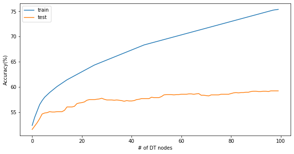

# Text Categorization With Decision Tree

Text categorization is an important task in natural language processing and information retrieval. For instance, news articles, emails or blogs are often classified by topics. Here I implemented a decision tree algorithm to learn a classifier that can assign a discussion board topic to an article. The algorithm is trained and tested with a subset of Reddit posts sourced from https://files.pushshift.io/reddit/ which is processed  using Google BigQuery. The dataset includes the first 1500 comments of August 2019 of each of the "r/books" and "r/atheism" subreddits, cleaned by removing punctuation and some offensive language, and limiting the words to only those used more than 3 times among all posts. These 3000 comments are split evenly into training and testing sets (with 1500 documents in each). 

To simplify implementation, these posts have been pre-processed and converted to the bag of words model. More precisely, each post is converted to a vector of binary values such that each entry indicates whether the document contains a specific word or not. Each line of the files `trainData.txt` and `testData.txt` are formatted `docId wordId` which indicates that `word wordId` is present in document `docId`. The files `trainLabel.txt` and `testLabel.txt` indicate the label/category (`1=atheism` or `2=books`) for each document (`docId` = line#). The file `words.txt` indicates which word corresponds to each `wordId` (denoted by the line#).

Here, each decision node corresponds to a word feature, and the leaf nodes correspond to a prediction of what newgroup the article belongs in. Two feature selection mechanisms as follows are experimented:

1. average information gain (evenly weighted across the leaves)
2. information gain weighted by the fraction of documents on each side of the split

